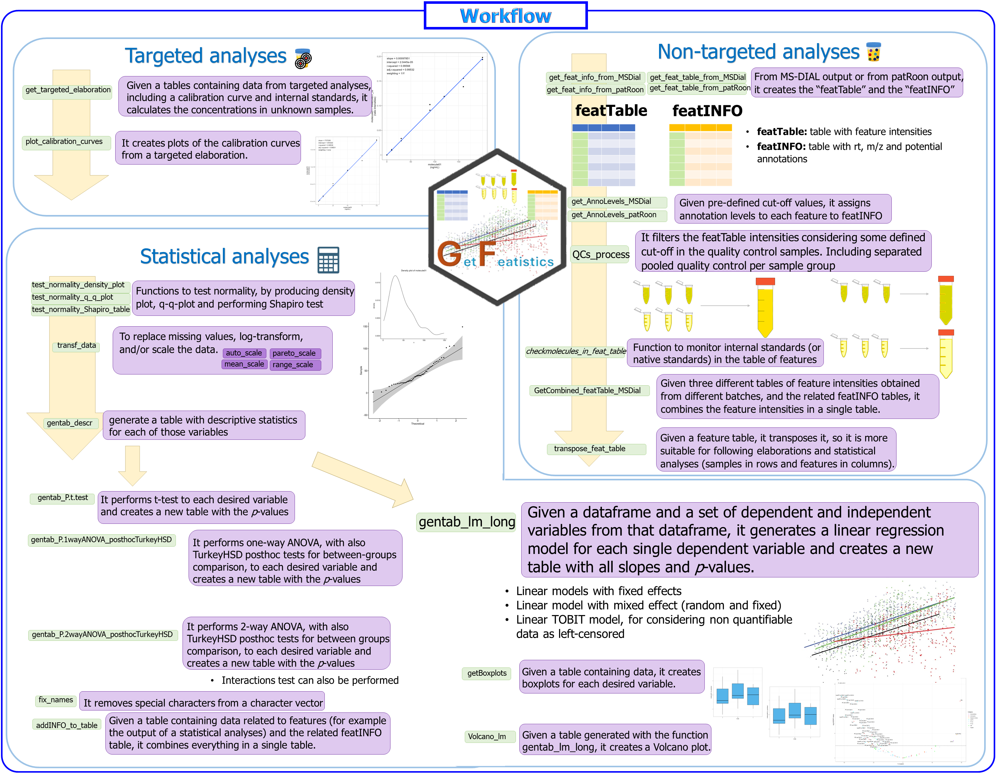

## GetFeatistics

Getting streamlined elaboration of targeted and non-targeted metabolomics data, including elaboration of feature tables, separate QC processing, advanced statistics such as multiple regression linear models with mixed effects, and more! This is the GetFeatistics (GF) package!


## First: Install it!

For installing the package, you can simply run this code. Let me know if it doesn't work!

```r
if (!require("devtools", quietly = TRUE)) {  
  install.packages("devtools")
}

devtools::install_github("FrigerioGianfranco/GetFeatistics", dependencies = TRUE)
```

## Then, use it!

Just type:
```r
library(GetFeatistics)
```

Then, an example of workflow is provided in the following picture. You can check the documentation of each function (for example: _?QCs_process_) to know how to use each argument. If something is not clear, please contact me!




## Lastly; Cite it!

If you use the package, please cite it:

_Frigerio Gianfranco, GetFeatistics R-pacakge, (2024), GitHub repository, https://github.com/FrigerioGianfranco/GetFeatistics_


## Credits

All the functions have been ideated, written, developed, tested, and are being maintained by Gianfranco Frigerio.
The work has been conducted by Gianfranco Frigerio, during his work at three different institutions:

- Center for Omics Sciences (COSR), IRCCS San Raffaele Scientific Institute, Milan, Italy (researcher).

- Luxembourg Centre for Systems Biomedicine (LCSB), University of Luxembourg, Belvaux, Luxembourg (postdoctoral researcher).

- Department of Clinical Sciences and Community Health, University of Milan, and Fondazione IRCCS Ca' Granda Ospedale Maggiore Policlinico, Milan, Italy (PhD student).


**Acknowledgement**:

Albina Rastoder, in the frame of her 2 months internship at the Luxembourg Centre for Systems Biomedicine (LCSB) of the University of Luxembourg, helped with some testing of some functions.
