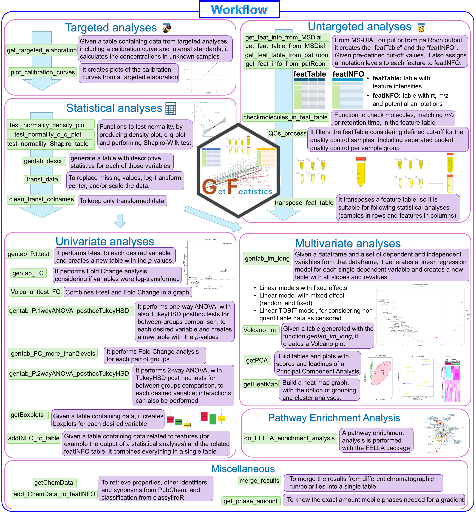

## GetFeatistics

Getting streamlined elaboration of targeted and non-targeted metabolomics data, including elaboration of feature tables, separate QC processing, advanced statistics such as multiple regression linear models with mixed effects, and more! This is the GetFeatistics (GF) package!


## First: Install it!

For installing the package, you can simply run this code. Let me know if it doesn't work!

```r
if (!require("devtools", quietly = TRUE)) {  
  install.packages("devtools")
}

devtools::install_github("FrigerioGianfranco/GetFeatistics", dependencies = TRUE)
```

## Then, use it!

Just type:
```r
library(GetFeatistics)
```

Then, an example of workflow is provided in the following picture.

Check also the vignette guiding you through the workflow step by step:

https://frigeriogianfranco.github.io/GetFeatistics/articles/GF_vignette.html

For more details, here the full documentation for all functions:

https://frigeriogianfranco.github.io/GetFeatistics/reference/


If something is not clear, please contact me!




## Lastly; Cite it!

If you use the package, please cite it:

Frigerio Gianfranco, GetFeatistics R-pacakge, (2024), GitHub repository, https://github.com/FrigerioGianfranco/GetFeatistics


## Credits

All the functions have been ideated, written, developed, tested, and are being maintained by Gianfranco Frigerio.
The work has been conducted by Gianfranco Frigerio, during his work at three different institutions:

- Center for Omics Sciences (COSR), IRCCS San Raffaele Scientific Institute, Milan, Italy (researcher).

- Luxembourg Centre for Systems Biomedicine (LCSB), University of Luxembourg, Belvaux, Luxembourg (postdoctoral researcher).

- Department of Clinical Sciences and Community Health, University of Milan, and Fondazione IRCCS Ca' Granda Ospedale Maggiore Policlinico, Milan, Italy (PhD student).


**Acknowledgement**:

All the people of the Proteomics and Metabolomics group (ProMeFa) of the Center for Omics Sciences (COSR), IRCCS San Raffaele Scientific Institute, are acknowledged for the support.

Albina Rastoder is acknowledged for helping with the testing of some functions during her 2 months internship at the Luxembourg Centre for Systems Biomedicine (LCSB) of the University of Luxembourg.
Prof. Dr. Emma Schymanski is thanked for the support and suggestions, and the entire Environmental Cheminformatics group of the LCSB is acknowledged for the help and feedback.

Prof. Dr. Silvia Fustinoni and the group of the Laboratory of Environmental and Industrial Toxicology at the Department of Clinical Sciences and Community Health, University of Milan, and Fondazione IRCCS Ca' Granda Ospedale Maggiore Policlinico are acknowledged for the support.


**Research funding**:

Funding support from the Luxembourg National Research Fund (FNR) for project A18/BM/12341006 is acknowledged.
