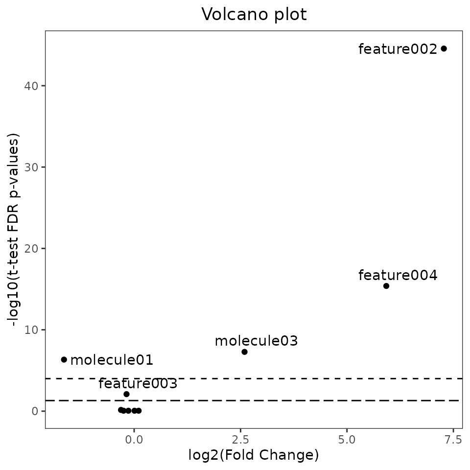
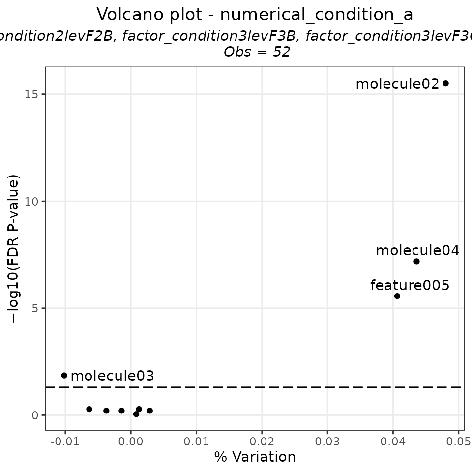

# Vignette of the GetFeatistics package

### Introduction

The **GetFeatistics** (GF) package provides several functions useful for
the elaboration of metabolomics data. In this vignette you will find an
example of a workflow using the functions of this package.

### Citation

If you use the package, please cite this paper:

Frigerio G (2025). “Streamlining feature elaboration and statistics
analysis in metabolomics: the GetFeatistics R-package.” *Journal of
Integrative Bioinformatics*. <https://doi.org/10.1515/jib-2025-0047>.

### Installation

Before installing, ensure the following are installed:

- R (version ≥ 4.3.1)
- Java (JDK), with the same architecture as R (64-bit or 32-bit).

Then open R (or RStudio) and run the following in the R console:

``` r
if (!require("devtools", quietly = TRUE)) {  
  install.packages("devtools")
}

devtools::install_github("FrigerioGianfranco/GetFeatistics", dependencies = TRUE)
```

Follow the on-screen instructions to install all dependencies. It may
take some time, but when it finishes the package should be fully
installed and ready to use.

#### Troubleshooting

If an error occurs, try again by running R with administrator privileges
(right-click R and select Run as administrator). If the error persists,
please contact me. Thank you for reporting any issues!

Remember that the R architecture (64-bit or 32-bit) must match your Java
architecture. You can check R’s architecture by running in the R
console:

``` r
R.version$arch
```

To check Java’s architecture, open Command Prompt and run:

``` r
java -version
```

If the architectures do not match, re-install R or Java from the
official websites. I recommend using the 64-bit architecture for both.

### Loading the package

The following line will load the package and all its dependencies in
your current working environment. Let’s start the fun!

``` r
library(GetFeatistics)
```

### Create mock data

In this vignette, we will use some mock data that simulate targeted and
untargeted metabolomics experiments.

``` r
create_df_examples()
#> 
#>  In the Global Environment, created the object  df_example_generic
#>  In the Global Environment, created the object  df_example_targeted
#>  In the Global Environment, created the object  df_example_targeted_legend
#>  In the Global Environment, created the object  df_example_targeted_compounds_legend
#>  In the Global Environment, created the object  df_example_sample_data
#>  In the Global Environment, created the object  df_example_feat_intensities
#>  In the Global Environment, created the object  df_example_feat_info
#>  In the Global Environment, created the object  df_example_qc_sampletype
#>  In the Global Environment, created the object  df_example_melecules_to_search
#>  In the Global Environment, created the object  df_example_gradient
```

The vignette is composed of four main chapters:

- **1. Targeted analyses**,
- **2. Non-targeted analyses**,
- **3. Statistical analyses**,
- **4. Miscellaneous**.

## 1. Targeted analyses

To elaborate a targeted analyses, we need to organise the data in at
least two tables:

1.  The first should contain the intensities of peak area. Samples in
    rows, analysed compounds in columns. Hopefully you can export this
    table from your chromatographic vendor software. Here we will be
    using the *df_example_targeted*:

``` r
df_example_targeted
#> # A tibble: 83 × 7
#>    samples          molecule01 molecule01_IS molecule02 molecule02_IS molecule03
#>    <chr>                 <dbl>         <dbl>      <dbl>         <dbl>      <dbl>
#>  1 blank                     0     85009210.          0       512295.          2
#>  2 blank                    12     85058549.         12       513398.        474
#>  3 blank                    45     85544475.         45       512771.          2
#>  4 calibration_cur…        862     84525132.      64851       512250.     184514
#>  5 calibration_cur…     916839     83570564.   69002371       513334.    3926523
#>  6 calibration_cur…    2437097     84157195.  122279121       510583.   13916386
#>  7 calibration_cur…    8664951     84662094.  217377977       513191.   51540480
#>  8 calibration_cur…   10163671     85495504.  254976452       514245.   90682659
#>  9 calibration_cur…   13164865     84600992.  402513548       512262.  132142516
#> 10 calibration_cur…   16546462     85375590.  622652692       513297.  177157699
#> # ℹ 73 more rows
#> # ℹ 1 more variable: molecule04 <dbl>
```

2.  We need to prepare a second table in which:

- the first column must be identical to the first column of the first
  table;
- the second column should contain the following: “blank”, “curve”,
  “qc”, or “unknown”.
- the third column should have the actual known values for “curve” and
  “qc” samples.

Not clear? Have a taste of the *df_example_targeted_legend*:

``` r
df_example_targeted_legend
#> # A tibble: 83 × 6
#>    samples               sample_type molecule01 molecule02 molecule03 molecule04
#>    <chr>                 <chr>            <dbl>      <dbl>      <dbl>      <dbl>
#>  1 blank                 blank               NA         NA         NA         NA
#>  2 blank                 blank               NA         NA         NA         NA
#>  3 blank                 blank               NA         NA         NA         NA
#>  4 calibration_curve_le… curve                0          0          0          0
#>  5 calibration_curve_le… curve               10        100          2         10
#>  6 calibration_curve_le… curve               30        200          8         30
#>  7 calibration_curve_le… curve               90        300         25         90
#>  8 calibration_curve_le… curve              120        400         50        120
#>  9 calibration_curve_le… curve              160        650         75        160
#> 10 calibration_curve_le… curve              200       1000        100        200
#> # ℹ 73 more rows
```

3.  Did I say “at least” two tables, remember? Well, even though it’s
    not mandatory, preparing a third table is useful especially if you
    work with internal standards. This data frame should contain four
    columns:

- in the first column, the name of the targeted molecules;
- in the second column, the matched internal standard (or NA if there
  isn’t an internal standard for that molecule);
- in the third column, the weighting factor you want for the calibration
  curve for that molecule. I highly recommend to use a weighting factor
  such as **1/X**, **1/Y**, or **1/(Y^2)** for a better accuracy of low
  concentrated analytes, but if you still don’t want, you can put “none”
  or NA;
- in the fourth column, the unit of measure of the known concentration
  (this is only for visualizations and it’s not considered for any
  calculation).

Yes, everything as in the *df_example_targeted_compounds_legend*:

``` r
df_example_targeted_compounds_legend
#> # A tibble: 4 × 4
#>   compounds  matched_IS    weighting unit 
#>   <chr>      <chr>         <chr>     <chr>
#> 1 molecule01 molecule01_IS 1/Y       ng/mL
#> 2 molecule02 molecule02_IS none      ug/mL
#> 3 molecule03 NA            1/(Y^2)   ng/mL
#> 4 molecule04 NA            NA        NA
```

Now that we have all the tables, we just need to pass them as the three
arguments of the *get_targeted_elaboration* function!

``` r
TARGETED_EXAMPLE_RESULTS <- get_targeted_elaboration(data_intensity = df_example_targeted,
                                                     data_legend = df_example_targeted_legend,
                                                     compound_legend = df_example_targeted_compounds_legend)
```

The output of the function is a list with 5 useful elements:

- *results_concentrations*: a table with the calculated concentrations
  (you will need only this for the following statistical analyses)
- *results_accuracy*: a table with the calculated accuracy (%) for curve
  points and qc. It’s good to check that most of these values are
  between 80% and 120%!
- *cv_internal_standards*: the relative standard deviation (%) of the
  intensities of internal standards.
- *compound_legend*: it’s the same table provided in the third argument.
  I thought it was good to keep this valuable information!
- *summary_regression_models*: stuff of the fitted linear regression
  models such as: slope, intercept, r squared, and adjusted r squared.
- *regression_models*: a list with the all the fitted regression models.

Amazing! Let’s check for example how the *results_concentrations* table
looks like:

``` r
TARGETED_EXAMPLE_RESULTS$results_concentrations
#> # A tibble: 83 × 6
#>    samples               sample_type molecule01 molecule02 molecule03 molecule04
#>    <chr>                 <chr>            <dbl>      <dbl>      <dbl>      <dbl>
#>  1 blank                 blank          -0.0209      -9.32   -0.0993       -2.19
#>  2 blank_2               blank          -0.0207      -9.32   -0.0990       -2.18
#>  3 blank_3               blank          -0.0204      -9.32   -0.0993       -2.19
#>  4 calibration_curve_le… curve          -0.0105      -9.22    0.00449      -2.08
#>  5 calibration_curve_le… curve          11.2        103.      2.11          9.09
#>  6 calibration_curve_le… curve          29.6        191.      7.73         27.8 
#>  7 calibration_curve_le… curve         105.         346.     28.9         104.  
#>  8 calibration_curve_le… curve         121.         406.     50.9         123.  
#>  9 calibration_curve_le… curve         159.         649.     74.2         160.  
#> 10 calibration_curve_le… curve         198.        1007.     99.6         201.  
#> # ℹ 73 more rows
```

Or maybe we want to see if the coefficient of determination is good
enough, that numeric value is reported in the
*summary_regression_models* table:

``` r
TARGETED_EXAMPLE_RESULTS$summary_regression_models
#> # A tibble: 4 × 5
#>   parameter     molecule01 molecule02  molecule03 molecule04
#>   <chr>              <dbl>      <dbl>       <dbl>      <dbl>
#> 1 slope          0.000979       1.19  1777751.      5140.   
#> 2 intercept      0.0000204     11.1    176526.     11237.   
#> 3 r.squared      0.996          0.994       0.995      0.992
#> 4 adj.r.squared  0.995          0.994       0.994      0.992
```

Well, they are calibration curves, right? So, better visualise them!
Let’s use the function *plot_calibration_curves*. It will create a list
of ggplots that you can either print on R or export using the
*export_figures* function.

``` r
TARGETED_EXAMPLE_CALIBRATION_CURVES <- plot_calibration_curves(targeted_elaboration = TARGETED_EXAMPLE_RESULTS)

TARGETED_EXAMPLE_CALIBRATION_CURVES$molecule01
#> `geom_smooth()` using formula = 'y ~ x'
```


``` r
export_figures(TARGETED_EXAMPLE_CALIBRATION_CURVES, exprt_fig_type = "pdf")
```

All the figures of this package are created as ggplot object, so they
can be furhter modified following the ggplot2 sintax.

Last step before moving to the next chapter: let’s store separately just
what we will need later for the statistics. Two easy steps.

1.  Collect the data frame of results of unknown samples in an object:

``` r
TARGETED_RESULTS_FOR_STATISTICS <- filter(TARGETED_EXAMPLE_RESULTS$results_concentrations, sample_type == "unknown")
```

2.  Collect the name of the variables in another distinct object:

``` r
TARGETED_MOLECULES <- TARGETED_EXAMPLE_RESULTS$compound_legend$compounds
```

## 2. Non-targeted analyses

This package is supposed to be used after obtaining a feature table
using open source tools such as XCMS and MS-Dial. In particular, we need
a table of feature intensities like this (This is just a simple example,
usually there are many more features!):

``` r
df_example_feat_intensities
#> # A tibble: 9 × 78
#>   featname   QCpooled_tot01 QCpooled_tot02 blank_untargeted01 QCpooled_tot03
#>   <chr>               <dbl>          <dbl>              <dbl>          <dbl>
#> 1 feature001       74181229       42824388             720501      657266255
#> 2 feature002      118220210      115639566               8321      106082721
#> 3 feature003      110622819      127316421                 NA      137718462
#> 4 feature004        2294835        2492735                 42        2504627
#> 5 feature005         153153         116759                 NA         196216
#> 6 feature006             NA      202824643           20093295         446030
#> 7 feature007         139350          80736                 NA          71090
#> 8 feature008       30986875       12910756              13343         754989
#> 9 feature009       20555071       21102214              23060             NA
#> # ℹ 73 more variables: QCpooled_F3A01 <dbl>, QCpooled_F3B01 <dbl>,
#> #   QCpooled_F3C01 <dbl>, unkwon_sample_001 <dbl>, unkwon_sample_002 <dbl>,
#> #   unkwon_sample_003 <dbl>, unkwon_sample_004 <dbl>, unkwon_sample_005 <dbl>,
#> #   unkwon_sample_006 <dbl>, unkwon_sample_007 <dbl>, unkwon_sample_008 <dbl>,
#> #   unkwon_sample_009 <dbl>, unkwon_sample_010 <dbl>, QCpooled_tot04 <dbl>,
#> #   QCpooled_F3A02 <dbl>, QCpooled_F3B02 <dbl>, QCpooled_F3C02 <dbl>,
#> #   unkwon_sample_011 <dbl>, unkwon_sample_012 <dbl>, …
```

and a featINFO table, whose first column must be identical to the first
column of the feature intensity table, and the other are retention
times, m/z, and any other valuable information related to that feature,
such as this one:

``` r
df_example_feat_info
#> # A tibble: 9 × 3
#>   featname      rt    mz
#>   <chr>      <dbl> <dbl>
#> 1 feature001   242  120.
#> 2 feature002   288  146.
#> 3 feature003   408  203.
#> 4 feature004   528  148.
#> 5 feature005   465  164.
#> 6 feature006   476  164.
#> 7 feature007   342  204.
#> 8 feature008   221  104.
#> 9 feature009   593  425.
```

If you worked with MS-Dial, you just need to export the areas or the
normalized areas, and then use the functions
*get_feat_table_from_MSDial* and *get_feat_info_from_MSDial*. For
example, something like that: (check the full documentation of the
functions if you want to know more!)

``` r

FEAT_TABLE_FROM_MSDIAL <- get_feat_table_from_MSDial(MSDIAL_raw_table_file_name = "FILE_AREA_EXPORTED_FROM_MSDIAL.txt",
                                                     n_last_coloums_to_delete = 2)

FEAT_INFO_FROM_MSDIAL <- get_feat_info_from_MSDial(MSDIAL_raw_table_file_name = "FILE_AREA_EXPORTED_FROM_MSDIAL.txt",
                                                   add_AnnoLevels = TRUE)
```

If you used XCMS while working within patRoon (and if you didn’t, I
suggest you to do it next time as patRoon is a great “docking station”
tool that feature several widely used R-based algorithms, such as
metFrag for example, check it out:
<https://github.com/rickhelmus/patRoon>) you can use the functions
*get_feat_table_from_patRoon* and *get_feat_info_from_patRoon*. Below
some examples (check the full documentation to learn how what to pass in
the arguments):

``` r
FEAT_TABLE_FROM_PATROON <- get_feat_table_from_patRoon(patRoon_featureGroups = _featureGroups_DATA_FRAME_FROM_patRoon_)

FEAT_INFO_FROM_PATROON <- get_feat_info_from_patRoon(patRoon_featureGroups = _featureGroups_DATA_FRAME_FROM_patRoon_,
                                                     patRoon_MFsummary = _MFsummary_DATA_FRAME_FROM_patRoon_,
                                                     MFsummary_score_columns = c("individualMoNAScore", "score"),
                                                     add_AnnoLevels = TRUE)
```

Great. The previous two chunks are not actually run, as in this vignette
we will be using the mock *df_example_feat_intensities* and
*df_example_feat_info*. If you have a list of actual chemical standards
(with or without the retention times) you can check if those standards
are present in your feature tables. To do so, you need to prepare a
table like *df_example_melecules_to_search*:

``` r
df_example_melecules_to_search
#> # A tibble: 8 × 4
#>   coumpound        rt    mz   CID
#>   <chr>         <dbl> <dbl> <dbl>
#> 1 Alanine         146  88.0  5950
#> 2 Asparagine      262 131.   6267
#> 3 Cysteine        243 120.   5862
#> 4 Glutamate       290 146.  33032
#> 5 Glycine         169  74.0   750
#> 6 Leucine          98 130.   6106
#> 7 Methionine      258 148.   6137
#> 8 Phenylalanine   471 164.   6140
```

Then, you can use the function *checkmolecules_in_feat_table* passing:

- the data frames of feature intensity, feature INFO, and known
  molecules to the first three arguments, respectively;
- the name of the column of the known molecules data frames containing
  m/z values to *mz_to_search* (or the third column will be taken as
  default);
- the accepted error value in *error*;
- “ppm” or “Da” in *error_type* (which is refering to the *error*
  value);
- TRUE to *check_rt* if you have retention times and want to also check
  them;
- the name of the column of the known molecules data frames containing
  retention time values to *rt_to_search* (or the second column will be
  taken as default);
- the accepted window of retention time to *rt_window* (and be sure that
  the unit, like seconds or minutes, is consistent!)
- finally, set *return_as_featinfo_lev1* to TRUE, so the the confirmed
  molecules will be marked as AnnoLevel “1” in the featINFO table.

``` r
df_example_feat_info_withLev1 <- checkmolecules_in_feat_table(featmatrix = df_example_feat_intensities,
                                                              featinfo = df_example_feat_info,
                                                              molecules_list = df_example_melecules_to_search,
                                                              mz_to_search = NULL,
                                                              error = 20,
                                                              error_type = "ppm",
                                                              check_rt = TRUE,
                                                              rt_to_search = NULL,
                                                              rt_window = 12,
                                                              return_as_featinfo_lev1 = TRUE)

df_example_feat_info_withLev1
#> # A tibble: 9 × 10
#>   featname      rt    mz coumpound     rt_molecule_list mz_molecule_list   CID
#>   <chr>      <dbl> <dbl> <chr>                    <dbl>            <dbl> <dbl>
#> 1 feature001   242  120. Cysteine                   243             120.  5862
#> 2 feature002   288  146. Glutamate                  290             146. 33032
#> 3 feature003   408  203. NA                          NA              NA     NA
#> 4 feature004   528  148. NA                          NA              NA     NA
#> 5 feature005   465  164. Phenylalanine              471             164.  6140
#> 6 feature006   476  164. Phenylalanine              471             164.  6140
#> 7 feature007   342  204. NA                          NA              NA     NA
#> 8 feature008   221  104. NA                          NA              NA     NA
#> 9 feature009   593  425. NA                          NA              NA     NA
#> # ℹ 3 more variables: AnnoLevel <chr>, rt_shift <dbl>, mz_shift <dbl>
```

Amazing!! Note that if you had a featINFO from MS-Dial or patRoon,
instead of this example featINFO, you would the AnnoLevel for all the
other features!

Now, if you are a good metabolomer, you know how much is important to
clean the dataset using well-established methods such as pooled quality
controls (QCs). If you want to filter the feature data table considering
defined cut-offs from the analyses of pooled QCs, you might want to read
the next step carefully!

First, you need to prepare a table containing the following information:

- The first column contains the sample names.
- The second column should contain “REMOVE” (to not consider at all
  those samples, I suggest to do so for the first analyses of each
  batch), “blank”, “QC”, “QC_half” (if you prepared some 50:50 dilution
  of pooled QC samples) or “unknown”.
- The third should be prepared only if separated pooled QCs were
  prepared. If you want more information of such an approach, please
  check the idea behind it by reading this paper:
  <https://doi.org/10.3390/molecules27082580>.

``` r
df_example_qc_sampletype
#> # A tibble: 77 × 3
#>    samples            action  qc_group
#>    <chr>              <chr>   <chr>   
#>  1 QCpooled_tot01     REMOVE  NA      
#>  2 QCpooled_tot02     REMOVE  NA      
#>  3 blank_untargeted01 blank   NA      
#>  4 QCpooled_tot03     QC      tot     
#>  5 QCpooled_F3A01     QC      F3A     
#>  6 QCpooled_F3B01     QC      F3B     
#>  7 QCpooled_F3C01     QC      F3C     
#>  8 unkwon_sample_001  unknown NA      
#>  9 unkwon_sample_002  unknown NA      
#> 10 unkwon_sample_003  unknown NA      
#> # ℹ 67 more rows
```

This table, together with the table of feature intensities, is all you
need to run the *QCs_process* function, which will filter out from your
table the features that will not meet the cut-offs:

- *step1*: if TRUE, features with a relative standard deviation (CV%)
  greater than the value defined in the *step1_cutoff* will be filtered
  out.
- *step2*: if TRUE, features not present in at least a percentage of QC
  samples as defined in *step2_cutoff* will be filtered out.
- *step3*: if TRUE, features with a blank contribution, i.e.: the ratio
  between mean of blank and mean of QC, greater than the value defined
  in the *step3_cutoff* will be filtered out.
- *step4*: if TRUE, features whose mean in “QC_half” samples are not
  between the percentage range of two values defined in *step4_cutoff*
  compared to the mean of QCs will be filtered out.
- Moreover, if *sep_QC* is TRUE, those steps will be performed
  separately in each QC groups, and then features that are confirmed in
  at least one of the groups defined in *QC_to_merge* will be kept.

``` r
UNTARGETED_FEAT_TABLE_QC_FILTERED <- QCs_process(featmatrix = df_example_feat_intensities,
                                                 sampletype = df_example_qc_sampletype,
                                                 sep_QC = TRUE,
                                                 QC_to_merge = c("tot", "F3A", "F3B", "F3C"),
                                                 step1 = TRUE,
                                                 step1_cutoff = 50,
                                                 step2 = TRUE,
                                                 step2_cutoff = 50,
                                                 step3 = TRUE,
                                                 step3_cutoff = 50,
                                                 step4 = FALSE,
                                                 step4_cutoff = c(20, 80),
                                                 rtrn_filtered_table = TRUE,
                                                 remove_results = TRUE,
                                                 remove_QC_and_blanks = TRUE)
#> After the QC processing, for tot the feature table was reduced from 9 to 5 fetures
#> After the QC processing, for F3A the feature table was reduced from 9 to 2 fetures
#> After the QC processing, for F3B the feature table was reduced from 9 to 3 fetures
#> After the QC processing, for F3C the feature table was reduced from 9 to 3 fetures
#> Furthermore, while considering the feature matrix combined of tot F3A F3B F3C the final table contained 6 features
```

I’d suggest also to filter the featINFO table accordingly, you could run
something like this:

``` r
UNTARGETED_FEAT_INFO_QC_FILTERED <- filter(df_example_feat_info_withLev1,
                                           featname %in% UNTARGETED_FEAT_TABLE_QC_FILTERED$featname)
```

Brilliant. Last step of this chapter is to prepare what we need for the
following statistical elaborations. Statistically speaking, considering
the samples as observations (so as rows) and the features as variables
(so as columns) is better for statistics. Luckily, I prepared a function
that transpose our current feature table:

``` r
UNTARGETED_RESULTS_FOR_STATISTICS <- transpose_feat_table(UNTARGETED_FEAT_TABLE_QC_FILTERED)
```

Finally, we also need to collect the feature names in a character vector
object:

``` r
FEATURES_CONSIDERED <- colnames(UNTARGETED_RESULTS_FOR_STATISTICS)[-1]
```

## 3. Statistical analysis

Not bad so far. Before actually start off with the statistics, let’s put
together the data from targeted and untargeted analyses in a single
dataframe, together also with some other variables relevant for your
samples (for example in an epidemiological study, we could have patient
data such as age, BMI, sex, and more). In this vignette we will use mock
data from the *df_example_sample_data* which contains three categorical
variables and two numerical variables.

``` r
EXAMPLE_TABLE_FOR_STATISTICAL_ANALYSES <- df_example_sample_data %>%
  left_join(TARGETED_RESULTS_FOR_STATISTICS, by = "samples") %>%
  left_join(UNTARGETED_RESULTS_FOR_STATISTICS, by = "samples")
```

Moreover, let’s put together the character vectors of the known molecule
variables from the targeted analyses with the character vector of the
feature names.

``` r
ALL_POTENTIAL_COMPOUNDS <- c(TARGETED_MOLECULES, FEATURES_CONSIDERED)
```

Obviously, if you have only targeted or only untargeted experiments, and
if you don’t have any other data to join, you can skip this preparatory
step and go directly on with the statistics.

### 3.1. Descriptive statistics

Have you ever wished of a table that gives you quick summary of the data
with mean or median, and/or with percentiles? Maybe also with the option
of doing it separately for each group of a defined categorical variables
(that could be for example the control/disease groups)? Your dream will
come true with the *gentab_descr* function! Just put the dataframe in
the first argument, the character vector with the name of all the
numerical variables of interest in the second argument, the name of the
factor variable in the third argument. You specify what you want in the
type argument, for example “median (5th; 95th percentile)”. Check the
full documentation by tying *?gentab_descr* to know the other options
such as setting a defined number of digital places, or how to consider
missing values.

``` r
EXAMPLE_DESCRIPTIVE_STATISTICS_RESULTS <- gentab_descr(df = EXAMPLE_TABLE_FOR_STATISTICAL_ANALYSES,
                                                       v = ALL_POTENTIAL_COMPOUNDS,
                                                       f = "factor_condition3lev",
                                                       type = "median (5th; 95th percentile)",
                                                       ROUND = TRUE,
                                                       dig = 3,
                                                       unit_mes = NA,
                                                       missing = "only if >0")
```

Don’t forget to export it as an external table with the
*export_the_table* function and it will be ready to be used as a table
of your next publication!

``` r
export_the_table(EXAMPLE_DESCRIPTIVE_STATISTICS_RESULTS, exprtname = "The_results_of_descriptive_statistics", exprt_type = "xlsx")
```

### 3.2. Data normalisation

Before moving to parametric inferential statistics, we should check if
the data are normally distributed. We could do it in three different
ways:

1.  We could plot a density plot and check if the data distribution
    resembles a Gaussian:

``` r
DENSITY_PLOTS <- test_normality_density_plot(df = EXAMPLE_TABLE_FOR_STATISTICAL_ANALYSES, v = ALL_POTENTIAL_COMPOUNDS)
DENSITY_PLOTS[[1]]
```


2.  We could plot a Q–Q plot, anchd check that all points are within the
    grey area of the graph:

``` r
QQPLOT <- test_normality_q_q_plot(df = EXAMPLE_TABLE_FOR_STATISTICAL_ANALYSES, v = ALL_POTENTIAL_COMPOUNDS)
QQPLOT[[1]]
```


3.  We could apply Shapiro–Wilk tests: if the *P*-value is less than a
    defined cut-off (classical 0.05) means that data are not normally
    distributed:

``` r
SHAPIRO_TABLE <- test_normality_Shapiro_table(df = EXAMPLE_TABLE_FOR_STATISTICAL_ANALYSES, v = ALL_POTENTIAL_COMPOUNDS, pvalcutoff = 0.05, cutpval = FALSE)
SHAPIRO_TABLE
#> # A tibble: 10 × 4
#>    variable   shap_test_result shap_test_pvalue normally_distributed
#>    <chr>                 <dbl>            <dbl> <lgl>               
#>  1 molecule01            0.602         1.26e-10 FALSE               
#>  2 molecule02            0.863         2.64e- 5 FALSE               
#>  3 molecule03            0.880         8.18e- 5 FALSE               
#>  4 molecule04            0.897         2.84e- 4 FALSE               
#>  5 feature002            0.775         1.62e- 7 FALSE               
#>  6 feature003            0.698         4.86e- 9 FALSE               
#>  7 feature004            0.636         4.26e-10 FALSE               
#>  8 feature005            0.802         6.50e- 7 FALSE               
#>  9 feature007            0.850         1.12e- 5 FALSE               
#> 10 feature009            0.945         2.42e- 2 FALSE
```

Most of the time, we need to normalise metabolomics data. We can do it
in one step with the *transf_data* function. Here a little guide to how
to prepare the arguments:

- As most of the statistical function of the package, put the data frame
  of interest, and a character vector with the name of the numerical
  columns of interest in the first two arguments.
- If *missing_replace* is TRUE, each NA in the data will be replaced by
  the minimum value of that variable, after being processed by an
  operation (“divide”, “multiply”, or “exponentiate”) passed to
  *missing_repl_type* and the value in *missing_repl_value*. For
  example, if you want to replace the missing values with 1/5 of the
  minimum value, set *missing_repl_type = “divide”* and
  *missing_repl_value = 5*. If you want to replace missing values with
  the squared root of the minimum value, set *missing_repl_type =
  “exponentiate”* and *missing_repl_value = 1/2*.
- If *log_transf* is TRUE, the data will be log-transformed and the base
  of the logarithm is the value reported in *log_base* (choose exp(1) is
  for the natural logarithm).
- If *scaling* is TRUE, data will be scaled considering what is reported
  in *scaling_type*, in particualr:
  - “mean_scale”: data are subtracted by the mean;
  - “auto_scale”: data are subtracted by the mean and divided by the
    standard deviation;
  - “pareto_scale”: data are subtracted by the mean and divided by the
    squared root of the standard deviation;
  - “range_scale”: data are subtracted by the mean and divided by the
    difference between the maximum and the minimum values.
- The output will be a table with more columns containing the
  transformed values, to automatically get the names of those columns in
  separate objects saved in the global environment, you can specify
  *vect_names_transf* as TRUE and the starting part of the name that
  object in *name_vect_names*

Hopefully running the example will make things clear:

``` r
EXAMPLE_TABLE_FOR_STATISTICAL_ANALYSES_transf <-  transf_data(df = EXAMPLE_TABLE_FOR_STATISTICAL_ANALYSES,
                                                              v = ALL_POTENTIAL_COMPOUNDS,
                                                              missing_replace = TRUE,
                                                              missing_repl_type = "divide",
                                                              missing_repl_value = 5,
                                                              log_transf = TRUE,
                                                              log_base = exp(1),
                                                              scaling = TRUE,
                                                              scaling_type = "pareto_scale",
                                                              vect_names_transf = TRUE,
                                                              name_vect_names = "ALL_POTENTIAL_COMPOUNDS_transf")
```

Look at the column names of the object: “\_mr” has been added for
missing value replaced, “\_ln” for the log-transformation, and
“paretosc” for the pareto scaling:

``` r
glimpse(EXAMPLE_TABLE_FOR_STATISTICAL_ANALYSES_transf)
#> Rows: 52
#> Columns: 47
#> $ samples                   <chr> "unkwon_sample_001", "unkwon_sample_002", "u…
#> $ factor_condition2lev      <fct> F2A, F2A, F2A, F2A, F2A, F2A, F2A, F2A, F2A,…
#> $ factor_condition3lev      <fct> F3A, F3A, F3A, F3A, F3A, F3A, F3A, F3A, F3A,…
#> $ factor_condition4lev      <fct> F4A, F4A, F4A, F4A, F4A, F4A, F4A, F4A, F4A,…
#> $ numerical_condition_a     <dbl> 4144.84, 2730.27, 1830.29, 3890.55, 1894.76,…
#> $ numerical_condition_b     <dbl> 4.9, 4.0, 5.9, 6.1, 14.8, 27.1, 23.0, 23.8, …
#> $ sample_type               <chr> "unknown", "unknown", "unknown", "unknown", …
#> $ molecule01                <dbl> 64.01434, 35.47336, 163.16339, 172.53414, 90…
#> $ molecule02                <dbl> 71.660272, 45.573955, 30.358801, 72.010810, …
#> $ molecule03                <dbl> 0.036142724, 0.437926820, 0.290853901, 0.014…
#> $ molecule04                <dbl> 78.6898920, 52.6804134, 37.6598743, 79.10643…
#> $ feature002                <dbl> 1041717, 1838405, 1833003, 2283669, 2295150,…
#> $ feature003                <dbl> 123288, 178957, 147968, 136045, 156292, 1620…
#> $ feature004                <dbl> 9409, 7624, 8385, 7474, 8628, 8940, 7626, 85…
#> $ feature005                <dbl> 115952, 104632, 106887, 241976, 43063, 15679…
#> $ feature007                <dbl> 43897, 36940, 185687, 134781, 39105, 228596,…
#> $ feature009                <dbl> 27104212, 39761464, 25144541, 32142174, 2883…
#> $ molecule01_mr             <dbl> 64.01434, 35.47336, 163.16339, 172.53414, 90…
#> $ molecule02_mr             <dbl> 71.660272, 45.573955, 30.358801, 72.010810, …
#> $ molecule03_mr             <dbl> 0.036142724, 0.437926820, 0.290853901, 0.014…
#> $ molecule04_mr             <dbl> 78.6898920, 52.6804134, 37.6598743, 79.10643…
#> $ feature002_mr             <dbl> 1041717, 1838405, 1833003, 2283669, 2295150,…
#> $ feature003_mr             <dbl> 123288, 178957, 147968, 136045, 156292, 1620…
#> $ feature004_mr             <dbl> 9409, 7624, 8385, 7474, 8628, 8940, 7626, 85…
#> $ feature005_mr             <dbl> 115952, 104632, 106887, 241976, 43063, 15679…
#> $ feature007_mr             <dbl> 43897, 36940, 185687, 134781, 39105, 228596,…
#> $ feature009_mr             <dbl> 27104212, 39761464, 25144541, 32142174, 2883…
#> $ molecule01_mr_ln          <dbl> 4.159107, 3.568782, 5.094752, 5.150595, 4.51…
#> $ molecule02_mr_ln          <dbl> 4.271937, 3.819336, 3.413086, 4.276816, 3.30…
#> $ molecule03_mr_ln          <dbl> -3.3202796, -0.8257035, -1.2349342, -4.26511…
#> $ molecule04_mr_ln          <dbl> 4.365515, 3.964244, 3.628595, 4.370794, 3.53…
#> $ feature002_mr_ln          <dbl> 13.85638, 14.42441, 14.42147, 14.64129, 14.6…
#> $ feature003_mr_ln          <dbl> 11.72228, 12.09490, 11.90475, 11.82074, 11.9…
#> $ feature004_mr_ln          <dbl> 9.149422, 8.939056, 9.034200, 8.919186, 9.06…
#> $ feature005_mr_ln          <dbl> 11.660932, 11.558205, 11.579527, 12.396594, …
#> $ feature007_mr_ln          <dbl> 10.68960, 10.51705, 12.13182, 11.81141, 10.5…
#> $ feature009_mr_ln          <dbl> 17.11520, 17.49841, 17.04015, 17.28568, 17.1…
#> $ molecule01_mr_ln_paretosc <dbl> -0.095654618, -0.766251137, 0.967217623, 1.0…
#> $ molecule02_mr_ln_paretosc <dbl> 1.08532715, 0.58954061, 0.14452697, 1.090672…
#> $ molecule03_mr_ln_paretosc <dbl> -2.9491548, -1.4902254, -1.7295601, -3.50173…
#> $ molecule04_mr_ln_paretosc <dbl> 0.90019580, 0.51688222, 0.19625440, 0.905239…
#> $ feature002_mr_ln_paretosc <dbl> -1.7080635, -1.3542181, -1.3560513, -1.21911…
#> $ feature003_mr_ln_paretosc <dbl> -2.297112, -2.089123, -2.195260, -2.242153, …
#> $ feature004_mr_ln_paretosc <dbl> -2.1304636, -2.2603710, -2.2016170, -2.27264…
#> $ feature005_mr_ln_paretosc <dbl> 0.137588664, 0.040306189, 0.060498877, 0.834…
#> $ feature007_mr_ln_paretosc <dbl> -0.59936838, -0.85153551, 1.50829588, 1.0400…
#> $ feature009_mr_ln_paretosc <dbl> 0.13079507, 0.66197920, 0.02676705, 0.367105…
```

Those name are also saved in different objects:

``` r
ALL_POTENTIAL_COMPOUNDS_transf_mr
#>  [1] "molecule01_mr" "molecule02_mr" "molecule03_mr" "molecule04_mr"
#>  [5] "feature002_mr" "feature003_mr" "feature004_mr" "feature005_mr"
#>  [9] "feature007_mr" "feature009_mr"
ALL_POTENTIAL_COMPOUNDS_transf_mr_ln
#>  [1] "molecule01_mr_ln" "molecule02_mr_ln" "molecule03_mr_ln" "molecule04_mr_ln"
#>  [5] "feature002_mr_ln" "feature003_mr_ln" "feature004_mr_ln" "feature005_mr_ln"
#>  [9] "feature007_mr_ln" "feature009_mr_ln"
ALL_POTENTIAL_COMPOUNDS_transf_mr_ln_paretosc
#>  [1] "molecule01_mr_ln_paretosc" "molecule02_mr_ln_paretosc"
#>  [3] "molecule03_mr_ln_paretosc" "molecule04_mr_ln_paretosc"
#>  [5] "feature002_mr_ln_paretosc" "feature003_mr_ln_paretosc"
#>  [7] "feature004_mr_ln_paretosc" "feature005_mr_ln_paretosc"
#>  [9] "feature007_mr_ln_paretosc" "feature009_mr_ln_paretosc"
```

I decided to create the function in a way that it explicates all the
results of the different steps of the transformations, to compare and
have access to the complete information in case of need. …But then I
realised the dataframe can have just too many columns!! To clean it and
have only the data of interest, and without those wired suffix, just run
the function: *clean_transf_colnames*

``` r
EXAMPLE_TABLE_FOR_STATISTICAL_ANALYSES_transf_cleaned <- clean_transf_colnames(df = EXAMPLE_TABLE_FOR_STATISTICAL_ANALYSES_transf,
                                                                               v = ALL_POTENTIAL_COMPOUNDS,
                                                                               suffix_to_consider = "_mr_ln_paretosc")
glimpse(EXAMPLE_TABLE_FOR_STATISTICAL_ANALYSES_transf_cleaned)
#> Rows: 52
#> Columns: 17
#> $ samples               <chr> "unkwon_sample_001", "unkwon_sample_002", "unkwo…
#> $ factor_condition2lev  <fct> F2A, F2A, F2A, F2A, F2A, F2A, F2A, F2A, F2A, F2A…
#> $ factor_condition3lev  <fct> F3A, F3A, F3A, F3A, F3A, F3A, F3A, F3A, F3A, F3A…
#> $ factor_condition4lev  <fct> F4A, F4A, F4A, F4A, F4A, F4A, F4A, F4A, F4A, F4A…
#> $ numerical_condition_a <dbl> 4144.84, 2730.27, 1830.29, 3890.55, 1894.76, 299…
#> $ numerical_condition_b <dbl> 4.9, 4.0, 5.9, 6.1, 14.8, 27.1, 23.0, 23.8, 24.8…
#> $ sample_type           <chr> "unknown", "unknown", "unknown", "unknown", "unk…
#> $ molecule01            <dbl> -0.095654618, -0.766251137, 0.967217623, 1.03065…
#> $ molecule02            <dbl> 1.08532715, 0.58954061, 0.14452697, 1.09067249, …
#> $ molecule03            <dbl> -2.9491548, -1.4902254, -1.7295601, -3.5017350, …
#> $ molecule04            <dbl> 0.90019580, 0.51688222, 0.19625440, 0.90523908, …
#> $ feature002            <dbl> -1.7080635, -1.3542181, -1.3560513, -1.2191125, …
#> $ feature003            <dbl> -2.297112, -2.089123, -2.195260, -2.242153, -2.1…
#> $ feature004            <dbl> -2.1304636, -2.2603710, -2.2016170, -2.2726418, …
#> $ feature005            <dbl> 0.137588664, 0.040306189, 0.060498877, 0.8342616…
#> $ feature007            <dbl> -0.59936838, -0.85153551, 1.50829588, 1.04004490…
#> $ feature009            <dbl> 0.13079507, 0.66197920, 0.02676705, 0.36710523, …
```

Voilà! Only what we need, transformed, and with cleaned names!

### 3.3. Univariate statistics with 2 groups

Let’s compare differences in two groups with a t-test. A t-test for each
numerical variable of interest will be performed with the following
function. Overall, we need to set the arguments in a similar way to
other functions of this package:

- the full data frame in the first argument;
- a character vector with column names of the numerical variable of
  interest in the second argument;
- the name of the column with the categorical variable (since this is a
  t-test, it must be a categorical variable with two levels) in the
  third argument;
- *paired* set to TRUE for a paired t-test;
- *FDR* to TRUE for further correcting the p-vales for multiple
  corrections across the different features;
- if *cutPval* is TRUE, every p-value below 0.001 will be replaced with
  “\<0.001”;
- if *groupdiff* is TRUE, additional columns specifying which group has
  the higher mean will be also added to the table, only for significant
  differences considering the cutoff specified in *pcutoff*;
- if *filter_sign* is TRUE, differences that have a p-value higher than
  *pcutoff* will be filtered out.

``` r
EXAMPLE_T_TEST <- gentab_P.t.test(df = EXAMPLE_TABLE_FOR_STATISTICAL_ANALYSES_transf_cleaned,
                                  v = ALL_POTENTIAL_COMPOUNDS,
                                  f = "factor_condition2lev",
                                  paired = FALSE,
                                  FDR = TRUE,
                                  cutPval = FALSE,
                                  groupdiff = TRUE,
                                  pcutoff = 0.05,
                                  filter_sign = FALSE)

EXAMPLE_T_TEST
#> # A tibble: 10 × 4
#>    variables   Pvalues PvaluesFDR group_diff
#>    <chr>         <dbl>      <dbl> <chr>     
#>  1 molecule01 1.85e- 7   4.62e- 7 F2A > F2B 
#>  2 molecule02 4.24e- 1   7.07e- 1 NA        
#>  3 molecule03 1.56e- 8   5.20e- 8 F2B > F2A 
#>  4 molecule04 7.41e- 1   8.85e- 1 NA        
#>  5 feature002 2.74e-46   2.74e-45 F2B > F2A 
#>  6 feature003 4.06e- 3   8.13e- 3 F2B > F2A 
#>  7 feature004 8.22e-17   4.11e-16 F2B > F2A 
#>  8 feature005 8.85e- 1   8.85e- 1 NA        
#>  9 feature007 8.00e- 1   8.85e- 1 NA        
#> 10 feature009 7.22e- 1   8.85e- 1 NA
```

We can also perform a Fold Change analysis! Differently from the t-test,
the Fold Change should be performed on data before the scaling (because
we don’t want data with negative values for the Fold Change!). We do
want to replace missing values though. While, if you performed or not
already the log-transformation can be specified in the *are_log_transf*
argument (and if TRUE, the function will do fold-change substracting the
data instead of the ratio. Logarithmic properties rulez!).
*second_to_first_ratio* as TRUE implies that you want to see the effect
of the group that is specified as the second level of the factor
compared to the first; the opposite will happen if FALSE.

``` r
EXAMPLE_TABLE_FOR_STATISTICAL_ANALYSES_missing_repl <-  transf_data(df = EXAMPLE_TABLE_FOR_STATISTICAL_ANALYSES,
                                                                    v = ALL_POTENTIAL_COMPOUNDS,
                                                                    missing_replace = TRUE,
                                                                    missing_repl_type = "divide",
                                                                    missing_repl_value = 5,
                                                                    log_transf = FALSE,
                                                                    scaling = FALSE,
                                                                    vect_names_transf = TRUE,
                                                                    name_vect_names = "ALL_POTENTIAL_COMPOUNDS_missing_repl")

EXAMPLE_TABLE_FOR_STATISTICAL_ANALYSES_missing_repl_cleaned <- clean_transf_colnames(df = EXAMPLE_TABLE_FOR_STATISTICAL_ANALYSES_missing_repl,
                                                                                     v = ALL_POTENTIAL_COMPOUNDS,
                                                                                     suffix_to_consider = "_mr")

EXAMPLE_FC <- gentab_FC(df = EXAMPLE_TABLE_FOR_STATISTICAL_ANALYSES_missing_repl_cleaned,
                        v = ALL_POTENTIAL_COMPOUNDS,
                        f = "factor_condition2lev",
                        second_to_first_ratio = TRUE,
                        paired = FALSE,
                        are_log_transf = FALSE,
                        log_base = 2,
                        filter_sign = FALSE,
                        FCcutoff = 2)

EXAMPLE_FC
#> # A tibble: 10 × 3
#>    variables       FC    logFC
#>    <chr>        <dbl>    <dbl>
#>  1 molecule01   0.319 -1.65   
#>  2 molecule02   0.807 -0.309  
#>  3 molecule03   6.04   2.59   
#>  4 molecule04   0.842 -0.249  
#>  5 feature002 155.     7.28   
#>  6 feature003   0.883 -0.179  
#>  7 feature004  60.7    5.92   
#>  8 feature005   1.08   0.105  
#>  9 feature007   0.910 -0.136  
#> 10 feature009   1.01   0.00813
```

Why not combining the information of the t-test and the Fold Change
analysis into a Volcano plot? You can do it with the function
*Volcano_ttest_FC*, that takes as input the results of the
*gentab_P.t.test* and *gentab_FC* functions. You can leave the other
arguments as default or personalise them, make sure to read the
documentation with *?Volcano_ttest_FC* first!

``` r
Volcano_plot_ttest_FC <- Volcano_ttest_FC(ttest_results = EXAMPLE_T_TEST,
                                          FC_results = EXAMPLE_FC,
                                          FDR = TRUE,
                                          log_base = 2,
                                          cut_off_names = -log10(0.05),
                                          line1_position = -log10(0.05),
                                          line2_position = -log10(0.0001),
                                          names_to_plot = NULL,
                                          category = NULL,
                                          col_pal = NULL)
Volcano_plot_ttest_FC
```



We could do also some box-plots already, but I will describe them in the
next section!

### 3.4. Univariate statistics with 3 or more groups

Very similarly to the t-test, we can do a one-way ANOVA, with
posthocTukeyHSD for pairwise group comparison. The argument are similar
to the *gentab_P.t.test* function, obviously in the third one we need to
put the name of a categorical variable with three or more levels:

``` r
EXAMPLE_ANOVA_1WAY <-  gentab_P.1wayANOVA_posthocTukeyHSD(DF = EXAMPLE_TABLE_FOR_STATISTICAL_ANALYSES_transf_cleaned,
                                                           v = ALL_POTENTIAL_COMPOUNDS,
                                                           f = "factor_condition3lev",
                                                           FDR = TRUE,
                                                           groupdiff = TRUE,
                                                           pcutoff = 0.05,
                                                           filter_sign = FALSE,
                                                           cutPval = FALSE)
glimpse(EXAMPLE_ANOVA_1WAY)
#> Rows: 10
#> Columns: 12
#> $ Dependent                      <chr> "molecule01", "molecule02", "molecule03…
#> $ factor_condition3lev_Pvalue    <dbl> 1.215946e-03, 2.574197e-01, 2.153475e-3…
#> $ F3B_vs_F3A_Pvalue              <dbl> 1.623657e-01, 2.376120e-01, 0.000000e+0…
#> $ F3C_vs_F3A_Pvalue              <dbl> 0.0007683746, 0.5422966698, 0.000000000…
#> $ F3C_vs_F3B_Pvalue              <dbl> 9.449651e-02, 8.558039e-01, 2.724086e-0…
#> $ factor_condition3lev_PvalueFDR <dbl> 2.431892e-03, 3.677425e-01, 1.076738e-2…
#> $ F3B_vs_F3A_PvalueFDR           <dbl> 2.706096e-01, 3.394457e-01, 0.000000e+0…
#> $ F3C_vs_F3A_PvalueFDR           <dbl> 0.001536749, 0.774709528, 0.000000000, …
#> $ F3C_vs_F3B_PvalueFDR           <dbl> 1.889930e-01, 9.841331e-01, 6.810215e-0…
#> $ F3B_vs_F3A                     <chr> NA, NA, "F3B > F3A", NA, "F3B > F3A", "…
#> $ F3C_vs_F3A                     <chr> "F3A > F3C", NA, "F3C > F3A", NA, "F3C …
#> $ F3C_vs_F3B                     <chr> NA, NA, "F3C > F3B", NA, "F3C > F3B", "…
```

A nice graphical visualisation of the distribution of the data can be
obtained with the following function that generate some boxplots:

``` r
EXAMPLE_BOX_PLOTS <- getBoxplots(df = EXAMPLE_TABLE_FOR_STATISTICAL_ANALYSES_transf_cleaned,
                                 v = ALL_POTENTIAL_COMPOUNDS,
                                 f = "factor_condition3lev")
EXAMPLE_BOX_PLOTS[[1]]
```


Since it generates a list with a box plot for each variable of interest.
We could use the *export_figures* to export them all in a single pdf
file:

``` r
export_figures(EXAMPLE_BOX_PLOTS, exprtname_figures = "All_the_amazing_boxplots", exprt_fig_type = "pdf")
```

I also prepared a cool functions that performs the Fold Change analyses
for each group pair! It is similar to *gentab_FC*, and I also added an
argument *only_on_positive* that you can set to TRUE if you want to be
sure the FC analysis is performed only on those positive data.

``` r
EXAMPLE_multiple_FC <- gentab_FC_more_than2levels(df = EXAMPLE_TABLE_FOR_STATISTICAL_ANALYSES_missing_repl_cleaned,
                                                  v = ALL_POTENTIAL_COMPOUNDS,
                                                  f = "factor_condition3lev",
                                                  second_to_first_ratio = TRUE,
                                                  paired = FALSE,
                                                  are_log_transf = FALSE,
                                                  log_base = 2,
                                                  only_on_positive = FALSE)
glimpse(EXAMPLE_multiple_FC)
#> Rows: 10
#> Columns: 7
#> $ variables        <chr> "molecule01", "molecule02", "molecule03", "molecule04…
#> $ F3A_vs_F3B_FC    <dbl> 0.6012417, 0.6853129, 145.8960113, 0.6952361, 69.0272…
#> $ F3A_vs_F3B_logFC <dbl> -0.7339830, -0.5451652, 7.1887966, -0.5244251, 6.1090…
#> $ F3A_vs_F3C_FC    <dbl> 0.3122194, 0.6735777, 356.2687121, 0.7191330, 168.164…
#> $ F3A_vs_F3C_logFC <dbl> -1.67936792, -0.57008366, 8.47682198, -0.47566941, 7.…
#> $ F3B_vs_F3C_FC    <dbl> 0.51929098, 0.98287615, 2.44193593, 1.03437242, 2.436…
#> $ F3B_vs_F3C_logFC <dbl> -0.94538494, -0.02491845, 1.28802535, 0.04875571, 1.2…
```

Ah! …and why, just one-way ANOVA?? Two-ways ANOVA are also an option and
can be obtained with the following function, specifying the two
categorical factor in the third argument and if we want interactions in
the *interact* argument:

``` r
EXAMPLE_ANOVA_2WAY <-  gentab_P.2wayANOVA_posthocTukeyHSD(DF = EXAMPLE_TABLE_FOR_STATISTICAL_ANALYSES_transf_cleaned,
                                                           v = ALL_POTENTIAL_COMPOUNDS,
                                                           f = c("factor_condition3lev", "factor_condition4lev"),
                                                           interact = FALSE,
                                                           FDR = TRUE,
                                                           groupdiff = TRUE,
                                                           pcutoff = 0.05,
                                                           filter_sign = FALSE,
                                                           cutPval = FALSE) 
```

Great, last part of this chapter: merging the statistics just obtained
with the featINFO table from an untargeted study! After all, the name of
this package is GetFeatistics (get features + statistics!!)

You can do that with the *addINFO_to_table* function:

``` r
FINAL_FEAT_INFO_COMBINED_WITH_STATISTICS <- addINFO_to_table(df1 = EXAMPLE_ANOVA_2WAY,  
                                                             colfeat_df1 = "Dependent",
                                                             dfINFO = UNTARGETED_FEAT_INFO_QC_FILTERED,
                                                             colfeat_dfINFO = "featname",
                                                             add_char_to_INFO = FALSE,
                                                             char_to_add_to_INFO = "_INFO")
#> Warning in addINFO_to_table(df1 = EXAMPLE_ANOVA_2WAY, colfeat_df1 =
#> "Dependent", : no correspondence for molecule01, which is the row number 1 of
#> the df1
#> Warning in addINFO_to_table(df1 = EXAMPLE_ANOVA_2WAY, colfeat_df1 =
#> "Dependent", : no correspondence for molecule02, which is the row number 2 of
#> the df1
#> Warning in addINFO_to_table(df1 = EXAMPLE_ANOVA_2WAY, colfeat_df1 =
#> "Dependent", : no correspondence for molecule03, which is the row number 3 of
#> the df1
#> Warning in addINFO_to_table(df1 = EXAMPLE_ANOVA_2WAY, colfeat_df1 =
#> "Dependent", : no correspondence for molecule04, which is the row number 4 of
#> the df1
```

The warnings that we got, tell us that the molecule of our mock target
analyses did not find a match in the featINFO, and that’s correct of
course!

This is a glimpse of the content of this table:

``` r
glimpse(FINAL_FEAT_INFO_COMBINED_WITH_STATISTICS)
#> Rows: 10
#> Columns: 42
#> $ featname                       <chr> NA, NA, NA, NA, "feature002", "feature0…
#> $ rt                             <dbl> NA, NA, NA, NA, 288, 408, 528, 465, 342…
#> $ mz                             <dbl> NA, NA, NA, NA, 146.0451, 203.0822, 148…
#> $ coumpound                      <chr> NA, NA, NA, NA, "Glutamate", NA, NA, "P…
#> $ rt_molecule_list               <dbl> NA, NA, NA, NA, 290, NA, NA, 471, NA, NA
#> $ mz_molecule_list               <dbl> NA, NA, NA, NA, 146.0453, NA, NA, 164.0…
#> $ CID                            <dbl> NA, NA, NA, NA, 33032, NA, NA, 6140, NA…
#> $ AnnoLevel                      <chr> NA, NA, NA, NA, "1", NA, NA, "1", NA, NA
#> $ rt_shift                       <dbl> NA, NA, NA, NA, -2, NA, NA, -6, NA, NA
#> $ mz_shift                       <dbl> NA, NA, NA, NA, -2e-04, NA, NA, 2e-04, …
#> $ Dependent                      <chr> "molecule01", "molecule02", "molecule03…
#> $ factor_condition3lev_Pvalue    <dbl> 2.903638e-04, 2.663669e-01, 7.957449e-2…
#> $ factor_condition4lev_Pvalue    <dbl> 3.064275e-03, 6.145504e-01, 7.452104e-0…
#> $ F3B_vs_F3A_Pvalue              <dbl> 0.1034203, 0.2463463, 0.0000000, 0.1071…
#> $ F3C_vs_F3A_Pvalue              <dbl> 0.0001736245, 0.5505073106, 0.000000000…
#> $ F3C_vs_F3B_Pvalue              <dbl> 0.053220429, 0.859040194, 0.003416264, …
#> $ F4B_vs_F4A_Pvalue              <dbl> 0.1329561, 0.9999989, 0.8263569, 0.9994…
#> $ F4C_vs_F4A_Pvalue              <dbl> 0.3763481, 0.9647013, 0.9995633, 0.9984…
#> $ F4D_vs_F4A_Pvalue              <dbl> 0.9254239, 0.9573175, 0.9936826, 0.9909…
#> $ F4C_vs_F4B_Pvalue              <dbl> 2.643875e-03, 9.617315e-01, 8.895006e-0…
#> $ F4D_vs_F4B_Pvalue              <dbl> 0.4376553, 0.9604912, 0.9424541, 0.9776…
#> $ F4D_vs_F4C_Pvalue              <dbl> 1.498325e-01, 7.820065e-01, 9.988015e-0…
#> $ factor_condition3lev_PvalueFDR <dbl> 5.807275e-04, 3.805241e-01, 1.989362e-2…
#> $ factor_condition4lev_PvalueFDR <dbl> 1.021425e-02, 8.669941e-01, 8.669941e-0…
#> $ F3B_vs_F3A_PvalueFDR           <dbl> 0.1786649, 0.3519233, 0.0000000, 0.1786…
#> $ F3C_vs_F3A_PvalueFDR           <dbl> 0.0003472491, 0.7864390152, 0.000000000…
#> $ F3C_vs_F3B_PvalueFDR           <dbl> 0.106440857, 0.984814311, 0.008540661, …
#> $ F4B_vs_F4A_PvalueFDR           <dbl> 0.4431869, 0.9999989, 0.9999989, 0.9999…
#> $ F4C_vs_F4A_PvalueFDR           <dbl> 0.9995633, 0.9995633, 0.9995633, 0.9995…
#> $ F4D_vs_F4A_PvalueFDR           <dbl> 0.9999925, 0.9999925, 0.9999925, 0.9999…
#> $ F4C_vs_F4B_PvalueFDR           <dbl> 0.0088129161, 0.9999351962, 0.999935196…
#> $ F4D_vs_F4B_PvalueFDR           <dbl> 0.9986349, 0.9986349, 0.9986349, 0.9986…
#> $ F4D_vs_F4C_PvalueFDR           <dbl> 4.994418e-01, 9.999897e-01, 9.999897e-0…
#> $ F3B_vs_F3A                     <chr> NA, NA, "F3B > F3A", NA, "F3B > F3A", "…
#> $ F3C_vs_F3A                     <chr> "F3A > F3C", NA, "F3C > F3A", NA, "F3C …
#> $ F3C_vs_F3B                     <chr> NA, NA, "F3C > F3B", NA, "F3C > F3B", "…
#> $ F4B_vs_F4A                     <chr> NA, NA, NA, NA, "F4A > F4B", NA, "F4B >…
#> $ F4C_vs_F4A                     <chr> NA, NA, NA, NA, "F4C > F4A", NA, "F4C >…
#> $ F4D_vs_F4A                     <chr> NA, NA, NA, NA, NA, NA, "F4D > F4A", NA…
#> $ F4C_vs_F4B                     <chr> "F4B > F4C", NA, NA, NA, "F4C > F4B", N…
#> $ F4D_vs_F4B                     <chr> NA, NA, NA, NA, "F4D > F4B", NA, "F4D >…
#> $ F4D_vs_F4C                     <chr> NA, NA, NA, NA, "F4C > F4D", NA, "F4D >…
```

Which we can finally export it this way:

``` r
export_the_table(FINAL_FEAT_INFO_COMBINED_WITH_STATISTICS)
```

### 3.5. Principal Component Analysis, and Heat Map with Cluster Analysis

In this section, I will show you two functions for some cool
multivariate data visualisation. The function might look complex, but
don’t be scared, I’ll explain everything you need to know! First of all,
in addition to the data frame we used for other statistical analyses
(df), we can optionally pass another one (dfv) containing information
about the metabolites (such as molecule categories). For the purpose of
this vignette we can prepare a data frame with a factor variable
indicating whether the compound is a molecule from the targeted analysis
or a feature from the untargeted experiment.

``` r
COMPOUNDS_INFO <- tibble(The_compounds = ALL_POTENTIAL_COMPOUNDS,
                           type = factor(ifelse(grepl("feature", ALL_POTENTIAL_COMPOUNDS), "feat", "mol"), levels = c("feat", "mol")))
```

Let’s look at the function for Principal Component Analysis (PCA):
*getPCA*.

- arguments *df* and *v* are the same as we saw before (the dataframe
  with data and the names of columns containing the data, respectively).
  Remember to use normalised data!
- *s* is optional and it’s the name of the column with samples names.
  Pass it only if you want those names on the score plot.
- *f*, also optional, is the name of the column with sample groups. Pass
  it only if you want to color the dots on score plot based on sample
  groups.
- *dfv*, optional, is the data frame with compound information we just
  created.
- *sv* and *fv*, similarly to *s* and *f* are optional and are the
  column names of the dfv data frame with names and group you want on
  the loading plot.
- even if you didn’t have a dfv fata frame, but you want the names on
  the loading plot, just pass this as TRUE.
- *col_pal* and *col_pal_fv* can be used to specified the colors for
  groups. If not specified some defined colors will be used.
- Choose the two PC you want on the score and loading plots by passing
  them here.
- set *ellipses_on_score* and /or *ellipses_on_loading* if you also want
  to create ellipses based on the groups.

The output of such a functions is a list with four objects: the score
and loading plots as ggplot objects, and the values of all principal
components for the scores and loading attached to the passed dataframes.

``` r
PCA_list <- getPCA(df = EXAMPLE_TABLE_FOR_STATISTICAL_ANALYSES_transf_cleaned,
                   v = ALL_POTENTIAL_COMPOUNDS,
                   s = NULL,
                   f = "factor_condition2lev",
                   dfv = COMPOUNDS_INFO,
                   sv = "The_compounds",
                   fv = "type",
                   labels_on_loading = TRUE,
                   col_pal = NULL,
                   col_pal_fv = NULL,
                   PC_to_plot = c("PC1", "PC2"),
                   ellipses_on_score = TRUE,
                   ellipses_on_loading = FALSE)

PCA_list$df_with_scores_table[,c("samples", "PC1", "PC2", "PC3", "PC4", "PC5", "PC6", "PC7", "PC8", "PC9")]
#> # A tibble: 52 × 10
#>    samples   PC1     PC2     PC3     PC4     PC5     PC6     PC7    PC8      PC9
#>    <chr>   <dbl>   <dbl>   <dbl>   <dbl>   <dbl>   <dbl>   <dbl>  <dbl>    <dbl>
#>  1 unkwon…  4.64  0.728  -0.213   0.0169  0.922  -0.715   0.0294 -0.153  0.540  
#>  2 unkwon…  3.44  0.262  -0.419  -0.0292  1.63   -0.424  -0.850  -0.504  0.00892
#>  3 unkwon…  3.86 -0.181  -0.365  -0.502  -0.529   1.39    0.0287 -0.447  0.138  
#>  4 unkwon…  5.01  1.08    0.0366 -0.416   0.0759  0.757   1.28   -0.343  0.413  
#>  5 unkwon…  3.60 -0.598  -0.877   0.376   0.570  -0.506  -0.341  -0.791  0.0229 
#>  6 unkwon…  3.80  0.356   0.0906 -0.611  -0.146   1.80   -0.272  -0.364  0.426  
#>  7 unkwon…  3.83 -0.600  -1.01   -1.42    1.06    0.441  -0.253   0.887 -0.648  
#>  8 unkwon…  3.72 -1.56   -1.81   -1.44   -1.94   -1.21   -0.325  -0.219  0.180  
#>  9 unkwon…  4.09 -1.31   -1.15    0.752  -0.420   0.465   0.410  -0.753 -0.217  
#> 10 unkwon…  3.85 -0.0997  0.0385  0.959   0.297  -0.0847 -0.302  -0.776 -0.259  
#> # ℹ 42 more rows

PCA_list$dfv_with_loadings_table[,c("The_compounds", "PC1", "PC2", "PC3", "PC4", "PC5", "PC6", "PC7", "PC8", "PC9")]
#> # A tibble: 10 × 10
#>    The_compounds     PC1     PC2      PC3      PC4      PC5     PC6     PC7
#>    <chr>           <dbl>   <dbl>    <dbl>    <dbl>    <dbl>   <dbl>   <dbl>
#>  1 molecule01     0.157  -0.0876  0.229    0.542   -0.597    0.182   0.328 
#>  2 molecule02     0.0851  0.416   0.285    0.0684   0.0437  -0.139  -0.0452
#>  3 molecule03    -0.547  -0.0383  0.136    0.130   -0.0945   0.253  -0.699 
#>  4 molecule04     0.0926  0.531   0.269    0.00501  0.00783  0.0321 -0.137 
#>  5 feature002    -0.444   0.319  -0.436   -0.232   -0.0363  -0.0815  0.399 
#>  6 feature003    -0.470  -0.304   0.674   -0.229    0.0732  -0.188   0.354 
#>  7 feature004    -0.487   0.258  -0.195    0.410   -0.173    0.0121  0.146 
#>  8 feature005     0.0597  0.521   0.305   -0.128    0.0656   0.134   0.0958
#>  9 feature007     0.0152 -0.0154 -0.00321 -0.484   -0.276    0.762   0.109 
#> 10 feature009    -0.0397 -0.0530  0.0209   0.400    0.718    0.491   0.238 
#> # ℹ 2 more variables: PC8 <dbl>, PC9 <dbl>

PCA_list$score_plot
```


``` r

PCA_list$loading_plot
```


Great, now let’s see how to do an heat map with or without cluster
analysis.

- The first set of arguments are similar to the previous function, but
  here you can specify multuple columns for *f* and *fv*, for example if
  you can divide your samples into different groups. For each column
  passed, colored bars will be added at the top and/or at the left of
  the heatmap to indicate the groups.
- In *order_df_by* and/or *order_dfv_by* we can put names of column to
  order the samples and/or features (these arguments are very useful,
  but will be completely ignored if you perform a cluster analysis, see
  below)
- By default *trnsp* is TRUE and the features will be as rows of the
  heatmap. The opposite will happen if *trnsp* is FALSE.
- *cluster_rows* and *cluster_columns* can be set to TRUE to perform the
  cluster analyses.
- *name_rows* and/or *name_columns*, can be set to TRUE to add the
  labels if the arguments *s* and/or *sv* were defined.
  *rotate_name_columns* is usefull as TRUE if you have long names and
  short space.
- *three_heat_colors* needs to be a vector of three colors: the
  rectangles will be colored with the first color if higher, or to the
  last color if lower.
- if *set_heat_colors_limits* is TRUE, the same maximum and minimum
  value will be set for the colors of the rectangles (also to ensure
  zero is always referring to the middle color). This is not really
  needed, though, if your data are well normalised. Those color limits
  can also be manually set with *heat_colors_limits*.
- *col_pal_list* can be left to NULL to use some default colors the
  grouping, or a list of color can be passed. Name each element of the
  list as the element passed to *f* and/or *fv* to ensure the matching.

``` r
HeatMap <- getHeatMap(df = EXAMPLE_TABLE_FOR_STATISTICAL_ANALYSES_transf_cleaned,
                      v = ALL_POTENTIAL_COMPOUNDS,
                      s = "samples",
                      f = c("factor_condition2lev", "factor_condition3lev"),
                      dfv = COMPOUNDS_INFO,
                      sv = "The_compounds",
                      fv = "type",
                      order_df_by = NULL,
                      order_dfv_by = NULL,
                      trnsp = TRUE,
                      cluster_rows = TRUE,
                      cluster_columns = TRUE,
                      name_rows = TRUE,
                      name_columns = FALSE,
                      rotate_name_columns = FALSE,
                      three_heat_colors = c("magenta", "white", "cyan"),
                      set_heat_colors_limits = FALSE,
                      heat_colors_limits = NULL,
                      col_pal_list = list(factor_condition3lev = c("magenta4", "skyblue1", "lightgreen"),
                                          type = c(mol = "pink", feat = "brown")))
HeatMap
```


### 3.6. Linear models

And now, the gem of the package and the statistical approach that I
personally like the most: multiple regression linear models!! The cool
part of linear model is that they can assess the association of
variables while taking into account for multiple potential confounding
factors.

All in a single function, that I called: *gentab_lm_long*.

within the function we can distinguish three modes, specified in the
*mdl* argument:

1.  “lm”: linear models (with fixed effects), using the *lm* function
    from the stats package. Usually, a multivariate linear model can be
    built, as example, with a formula like this: dependent_variable ~
    independent_variable1 + independent_variable2 +
    independent_variable3

In this function, different linear models will be fitted, one for each
dependent variable of interest. Usually I would consider as dependent
variable each measured molecule/feature. - As for previosu function, put
the full data frame in the first argument and a character vector with
all the numeric variable names to be considered as dependent
variables; - Now, pay attention to the third argument, *form_ind*: there
you need to put everything you would put after the ~ of the formula.
Like: “independent_variable1 + independent_variable2 +
independent_variable3”. They must be names of columns with numeric or
factor variables in the dataframe; - if *var_perc* is TRUE, besides the
slope, an additional column with the variation percentage will be added.
The data in the dependent variables should be log-transformed and scaled
to correctly do this operation. The variation percentage is calculated
this way: (((base^beta)-1)\*100). The base of the logaritm have to be
provided in the *base* argument (exp(1) is 2.718282… so for the natural
logaritm). - Similarly to previously described functions, *FDR* as TRUE
is to add the multiple correction to the p-value, *filter_sign* as TRUE
is to keep only results with a p-value below what we indicate in
*pcutoff* and *cutPval* as TRUE will replace p-value\<0.001 with
“\<0.001”.

``` r
EXAMPLE_LINEAR_MODEL <- gentab_lm_long(df = EXAMPLE_TABLE_FOR_STATISTICAL_ANALYSES_transf_cleaned,
                                       dep = ALL_POTENTIAL_COMPOUNDS,
                                       form_ind = "factor_condition2lev + factor_condition3lev + numerical_condition_a + numerical_condition_b",
                                       mdl = "lm",
                                       var_perc = TRUE,
                                       base = exp(1),
                                       FDR = TRUE,
                                       filter_sign = FALSE,
                                       pcutoff = 0.05,
                                       cutPval = FALSE)
```

Let’s have a glimpse to the table that we got out of it: - For each
line, there are the columns *dependent* and *independent*. Among the
independents, there will be the “(Intercept)”, that doesn’t really have
any biological significance. For categorical variables, independent will
contain the name of each non-reference group. For example, the variable
*factor_condition3lev* has 3 levels: “F3A”, “F3B”, and “F3C”; Since
“F3A” is the reference category, *independent* will contain:
“factor_condition3levF3B”, which tell us about the association of the
dependent variable in F3B vs F3A, and “factor_condition3levF3C”,
explaining what happens comparing F3C vs F3A. - *N_observations*: is a
check that tell us how many observations have been used for that linear
model. - *beta* is the slope for that dependent and independent
variables, *beta_95confint_lower* and *beta_95confint_upper* are the
lower and upper limit of the 95% confidence interval of the beta, *SE*
is the standard error of it; and *adj_R_sqrd* is the adjuster R squared
of the model. - *Pvalue* and *FDR_Pvalue* are the p-value referred to
the beta being significantly different from zero. - *negative_log10p*
and *negative_log10fdr* are the negative log-transformed (base 10)
P-values (usefull for VOlcano plots, see later) - *variation_perc* is
the calculated variation percentage

``` r
glimpse(EXAMPLE_LINEAR_MODEL)
#> Rows: 60
#> Columns: 13
#> $ Dependent            <chr> "feature003", "feature002", "molecule03", "featur…
#> $ Independent          <chr> "(Intercept)", "(Intercept)", "(Intercept)", "(In…
#> $ N_observations       <int> 52, 52, 52, 52, 52, 52, 52, 52, 52, 52, 52, 52, 5…
#> $ beta                 <dbl> -2.16471000, -1.44534693, -2.00260774, -1.7145888…
#> $ beta_95confint_lower <dbl> -2.275528779, -1.624986904, -2.349320186, -2.1992…
#> $ beta_95confint_upper <dbl> -2.05389122, -1.26570695, -1.65589530, -1.2299462…
#> $ SE                   <dbl> 0.05505441, 0.08924456, 0.17224562, 0.24076890, 0…
#> $ adj_R_sqrd           <dbl> 0.99469949, 0.98265234, 0.94304115, 0.87591788, 0…
#> $ Pvalue               <dbl> 4.708802e-37, 1.256317e-20, 2.728724e-15, 5.99511…
#> $ FDR_Pvalue           <dbl> 4.708802e-36, 6.281586e-20, 9.095747e-15, 1.49877…
#> $ negative_log10p      <dbl> 36.32708957, 19.90090070, 14.56404035, 8.22220279…
#> $ negative_log10fdr    <dbl> 35.32708957, 19.20193069, 14.04116161, 7.82426278…
#> $ variation_perc       <dbl> -88.521678, -76.433570, -86.501718, -81.996228, -…
```

These are great data for a Volcano plot! Considering an independent
variable, a Volcano plot will allow us to see the associations with it
of all the dependent variables at once:

- put the linear models table results in the first argument;
- the independent variable name in the second argument;
- in the third and fourth augment, we put what we want in the x-axis
  (usually “beta” or “variation_perc”) and on the y-axis
  (“negative_log10p” or “negative_log10fdr”);
- if we set *dep_cat* as TRUE and we specify in *category* a further
  column in the table with a categorization for the dependent variables
  (for example the class of the molecules), then the dots will be
  differently colored based on that categories;
- only the names of the dependent variables with an Y-valuegrater than
  the *cut_off_names* will be shown (so if we only whant names of what
  has a P-value lower than 0.0001, we can put here -log10(0.0001));
- with *line1* and/or *line2* set to TRUE, additional horizontal dotted
  lines will be reported in the *line1_position* and/or
  *line2_position*.

``` r
EXAMPLE_VOLCANO_PLOT_1 <- Volcano_lm(tab = EXAMPLE_LINEAR_MODEL,
                                     ind_main = "numerical_condition_a",
                                     x_values = "variation_perc",
                                     y_values = "negative_log10fdr",
                                     dep_cat = FALSE,
                                     category = NULL,
                                     cut_off_names = -log10(0.05),
                                     line1 = TRUE,
                                     line1_position = -log10(0.05),
                                     line2 = FALSE)

EXAMPLE_VOLCANO_PLOT_1
```



As usual, we can easily export it in this way:

``` r
export_figures(EXAMPLE_VOLCANO_PLOT_1, exprt_fig_type = "png", plot_sizes = c(14, 14), plot_unit = "in")
```

Pay attention: if we want to generate a Volcano plot to appreciate the
association with a categorical variable, remember that the name of the
independent variables includes also the group we want to check (compared
to the reference group):

``` r
EXAMPLE_VOLCANO_PLOT_2 <- Volcano_lm(tab = EXAMPLE_LINEAR_MODEL,
                                     ind_main = "factor_condition2levF2B",
                                     x_values = "variation_perc",
                                     y_values = "negative_log10fdr",
                                     dep_cat = FALSE,
                                     category = NULL,
                                     cut_off_names = -log10(0.05),
                                     line1 = TRUE,
                                     line1_position = -log10(0.05),
                                     line2 = FALSE)

EXAMPLE_VOLCANO_PLOT_2
```


2.  “lmer”: linear models with mixed effects (random and fixed), using
    the *lmer* function from the lme4 package. These models are
    particularly useful if we want to include co-variates that contain
    observations not independently each other (we would use a random
    effect in that case). For example, in a time series analyses on same
    patients, the variable identifying the patients should be considered
    as an independent variable with random effects in this way:
    dependent_variable ~ independent_variable1 + independent_variable2 +
    (1\|variable_with_random_effects)

Just as before, everything after the “~” should be passed to the third
argument of the *gentab_lm_long* function (as multiple models will be
fitted, each for each dependent variable passed in the second argument):

``` r
EXAMPLE_MIXED_LINEAR_MODEL <- gentab_lm_long(df = EXAMPLE_TABLE_FOR_STATISTICAL_ANALYSES_transf_cleaned,
                                             dep = ALL_POTENTIAL_COMPOUNDS,
                                             form_ind = "factor_condition2lev + numerical_condition_a + (1|factor_condition4lev)",
                                             mdl = "lmer",
                                             var_perc = TRUE,
                                             base = exp(1),
                                             FDR = TRUE,
                                             filter_sign = FALSE,
                                             pcutoff = 0.05,
                                             cutPval = FALSE)
```

3.  “tobit”: TOBIT linear models, using the *tobit* function of the AER
    package. Particularly useful for the targeted analyses, Tobit models
    are useful to treat dependent variable as both categorical and
    continuous variables. In particular, if we have a value below the
    Lower Limit Of Detection of our analytical method, we can pass those
    as left-censored values; and if we have values higher than the the
    Upper Limit Of Detection, we can specify them as right censored
    values. The *left_cens* and *right_cens* arguments are made for
    this: we can pass a named numeric vector with those values (the
    names of the vector must be the dependent variables). Of course if
    we transformed the data, we should transform these data as well:

``` r
LOD_molecules_ln_paretosc <- c(molecule01 = (log(10)-mean(log(EXAMPLE_TABLE_FOR_STATISTICAL_ANALYSES$molecule01)))/sqrt(sd(log(EXAMPLE_TABLE_FOR_STATISTICAL_ANALYSES$molecule01))),
                               molecule02 = (log(100)-mean(log(EXAMPLE_TABLE_FOR_STATISTICAL_ANALYSES$molecule02)))/sqrt(sd(log(EXAMPLE_TABLE_FOR_STATISTICAL_ANALYSES$molecule02))),
                               molecule03 = (log(1)-mean(log(EXAMPLE_TABLE_FOR_STATISTICAL_ANALYSES$molecule03)))/sqrt(sd(log(EXAMPLE_TABLE_FOR_STATISTICAL_ANALYSES$molecule03))),
                               molecule04 = (log(10)-mean(log(EXAMPLE_TABLE_FOR_STATISTICAL_ANALYSES$molecule04)))/sqrt(sd(log(EXAMPLE_TABLE_FOR_STATISTICAL_ANALYSES$molecule04))))

EXAMPLE_TOBIT_LINEAR_MODEL <- gentab_lm_long(df = EXAMPLE_TABLE_FOR_STATISTICAL_ANALYSES_transf_cleaned,
                                             dep = c("molecule01", "molecule02", "molecule03", "molecule04"),
                                             form_ind = "factor_condition2lev + numerical_condition_a",
                                             mdl = "tobit",
                                             left_cens = LOD_molecules_ln_paretosc,
                                             right_cens = NULL,
                                             var_perc = TRUE,
                                             base = exp(1),
                                             FDR = TRUE,
                                             filter_sign = FALSE,
                                             pcutoff = 0.05,
                                             cutPval = FALSE)
```

### 3.7. Pathway Enrichment Analysis

To perform a Pathway Enrichment Analysis, we need first to have the KEGG
codes of the known molecules. No, you don’t need to manually look for
them, I have a function also for that, of course: *getChemData* and
*add_ChemData_to_featINFO* and .They are basically the same function,
but the second one is specifically coded to add the retrieved chemical
data to the featINFO table, so we’ll be looking at it and to its
arguments:

- *featINFO*: the feat table you want to augment with the chemical data.
- *name_column_id*: The name of the column of *featINFO* containing a
  starting identifier, that needs to be indicated in the next argument.
- *idtype*: The type of identifier reported in the column
  *name_column_id* of the *featINFO* table. It must be one of the
  following: “CID”, “SMILES”, “InChI”, “InChIKey”. (Just for your to
  know: if “CID”, the function will already use it for retrieving the
  following chemical data from PubChem; otherwise, it will first
  retrieve the CID, and then use it).
- *properties*: it can be NULL (default), “all”, or a character vector
  with chemical properties to be retrieved from PubChem (for example:
  “Title”, “SMILES”, “InChI”, “InChIKey”, “IUPACName”,
  “MolecularWeight”, “ExactMass”, “MonoisotopicMass”) .
- *otheridentifiers*: NULL (default), “all”, or a character vector with
  the desired other identifiers you want to retrieve from PubChem, such
  as “CAS”, “HMDB”, “KEGG”, “ChEBI”, “ChEMBL”, “DrugBank”, “DSSTox”.
- *synonyms* NULL (default) of an integer number with the number of
  synonyms you want to retrieve from PubChem (max is 999!)
- *ClassiFire* NULL (default), “all”, or a character vector with wanted
  classification levels from ClassiFireR, such as: “kingdom”,
  “superclass”, “class”, “subclass”, “level 5”, “level 6”, “level 7”,
  “level 8”.

Ah, you need to have a stable internet connection to run this function!
And it can take quite some time if you have hundreds of compounds to
fetch!

``` r
FINAL_FEAT_INFO_COMBINED_WITH_STATISTICS_WITH_KEGG <- add_ChemData_to_featINFO(featINFO = FINAL_FEAT_INFO_COMBINED_WITH_STATISTICS,
                                                                               name_column_id = "CID",
                                                                               idtype = "CID",
                                                                               otheridentifiers = "KEGG")
```

So, a pathway enrichment analysis can be performed following the
workflow of this package using the tool FELLA
(<https://doi.org/10.1186/s12859-018-2487-5>). I wrapped everything we
need to do that in the function *do_FELLA_enrichment_analysis*:

- *organism_code* is the three letter code of the organism. “hsa” is for
  human (<https://www.genome.jp/kegg/tables/br08606.html>).
- *KEGG_codes* are the KEGG codes of the metabolites of interest (like
  the one you found statistically significant).
- *path_databases* is were you have the FELLA database and if you don’t
  have already, where they will be automatically created.
- The function will both creating objects in the global environment and
  also exporting csv table and png picture in the working directory.
  *output_prefix* and *output_suffix* can add some other characters to
  those object and file names.

``` r
do_FELLA_enrichment_analysis(organism_code = "hsa",
                             KEGG_codes = FINAL_FEAT_INFO_COMBINED_WITH_STATISTICS_WITH_KEGG$KEGG,
                             path_databases = "C:/databases/FELLA/",
                             output_prefix = "FELLA_enrichment_an_",
                             output_suffix = "")
```

## 4. Miscellaneous

There are some miscellaneous functions that I prepared that can be
generically useful.

I already mentioned *getChemData* (and particularly its wrapper
*add_ChemData_to_featINFO*).

Some are to adjust variable or sample names like: *zero_prefixing* (to
get some names ordered by name correctly), *fix_duplicated*, *fix_names*
(to remove special characters) and the related
*check_if_fix_names_needed*. I am also particularly proud of
*get_phase_amount* (to know the exact amount mobile phases needed for a
gradient) and of *GetCombined_featTable_MSDial* (to combine three
feature intensity tables from different batches into a single one)

I would particularly speak here in more details of *merge_results*.
Suppose you perform your untargeted analyses, and then the statistical
analyses, on different combinations of chromatographic runs and mass
polarity (such as HILIC POS, RPLC NEG). Wouldn’t you like to combine the
results into a single table? Your wish will be granted with
*merge_results*:

- combine your result tables in a list, then pass it to *results_list*
- if sample names of different batches of analyses are identical, except
  for some string (for example: “SAMPLE_NAME1_HILIC_POS”,
  “SAMPLE_NAME2_HILIC_POS”…), pass to *strings_in_colnames_to_remove*
  what you need to remove to make sample names idendical.
- The reference column that will be used to look for duplicates (for
  example the compound names) should be passed to *by_column*. For
  example you only want to keep one of each unique compound from your
  different result tables.
- But how to prioritise the feature table from which taking that
  compound? by specifying the *if_duplicated_consider_columns*. Can be
  more than one, for example look the one with the lowest “PvaluesFDR”,
  and in case of tie, look “Pvalues”.
- For each column passed to *if_duplicated_consider_columns*, if you
  want to do the raking in decreasing order set *decreasing* to TRUE. In
  the example of p-values we want to prioritise lower p-values first, so
  *decreasing* should set to FALSE
- A new table will be returned with a column called *name_new_column*
  with the combined results (and also printing what happpened in case of
  duplicated to the console!)

``` r
MERGED_TABLE <- merge_results(results_list = list(HILIC_POS = _A_DF_WTIH_RESULTS_, RPLC_NEG = _ANOTHER_DF_WITH_RESULTS_),
                              strings_in_colnames_to_remove = c("HILIC_POS", "RPLC_NEG"),
                              by_column = "variables",
                              if_duplicated_consider_columns = c("PvaluesFDR", "Pvalues"),
                              decreasing = c(FALSE, FALSE),
                              name_new_column = "chromatographic_run")
```

### Conclusion

I hope you enjoying the GetFeatistics package! Don’t forget to check the
full documentation for each function. And don’t forget to cite it if you
use if for your elaborations! Finally, thank you for reporting me any
issue or bug you might encounter while using this package!
